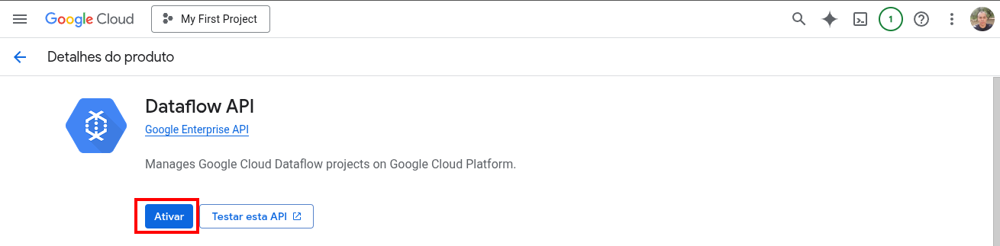

# Preparação do cluster Dataproc

Os notebooks das duas aulas rodam no JupyterLab de um cluster Dataproc. Este documento é o passo zero:
como criar o cluster e garantir que ele tenha saída para a internet.

## Por que a internet é um passo à parte

O cluster precisa de dois acessos diferentes, e eles não são a mesma coisa:

- **APIs do Google** (Dataproc, Pub/Sub, BigQuery, Storage): a VM alcança essas APIs mesmo sem IP externo,
  através do Private Google Access.
- **Internet aberta** (PyPI e GitHub): exige um Cloud NAT no projeto ou um IP externo na VM.

E aqui está a parte que pega: **a partir da imagem 2.2, o cluster nasce sem IP externo**. A documentação
oficial é explícita — *"By default, Managed Service for Apache Spark 2.2 and later image version clusters
provision VMs with internal-IP-only addresses"* — e completa que *"by default, internal-ip-only clusters
don't have access to the internet. Therefore, jobs that download dependencies from the internet [...] will
fail"*.

O efeito é traiçoeiro porque o próprio Dataproc habilita o Private Google Access na sub-rede
automaticamente. Resultado: o cluster cria normalmente, o JupyterLab abre, as chamadas ao Pub/Sub e ao
BigQuery funcionam — e só o `pip install` e o `git clone` ficam pendurados até dar timeout. Foi
exatamente o que aconteceu na aula de 2025.

Há dois jeitos de resolver, e a escolha depende de como o cluster é criado:

- **Pela linha de comando**: basta a flag `--public-ip-address` na criação, como na seção 2. Não exige
  nenhuma configuração prévia no projeto.
- **Pela interface**: desmarcar `Apenas IP interno` no formulário **não resolve** — o cluster continua
  saindo sem IP externo. Nesse caso o caminho é o Cloud NAT da seção 1.2, configurado uma vez no
  projeto, que vale para todo cluster criado ali.

O Cloud NAT também é o único caminho quando a organização proíbe IPs externos, como explica a seção 6.

## 1. Configuração do projeto (uma vez, pelo professor)

Os alunos não precisam — e normalmente não têm permissão — para rodar esta seção. Feita uma vez, ela vale
para todo cluster criado no projeto.

Os comandos `gcloud` deste documento podem ser rodados no Cloud Shell, o terminal embutido no console:
clique no ícone de terminal no canto superior direito e uma janela abre na parte de baixo da tela.


```bash
export PROJECT_ID=<projeto-da-aula>
export REGION=us-central1
```

### 1.1. Habilitar as APIs

```bash
gcloud services enable \
    dataproc.googleapis.com \
    compute.googleapis.com \
    dataflow.googleapis.com \
    pubsub.googleapis.com \
    bigquery.googleapis.com \
    --project $PROJECT_ID
```

Pela interface, cada API é habilitada na própria página do produto:



### 1.2. Cloud NAT

É o que dá saída para a internet aos clusters, e é o passo que faltou na aula de 2025:

```bash
gcloud compute routers create roteador-aula-pdm \
    --network=default --region=$REGION --project $PROJECT_ID

gcloud compute routers nats create nat-aula-pdm \
    --router=roteador-aula-pdm \
    --region=$REGION \
    --auto-allocate-nat-external-ips \
    --nat-all-subnet-ip-ranges \
    --project $PROJECT_ID
```

O NAT leva um ou dois minutos para propagar e é cobrado por hora enquanto existir. Se as aulas forem
distantes uma da outra, dá para apagá-lo entre elas com `gcloud compute routers delete roteador-aula-pdm`.

<!-- print do ensaio: tela do Cloud NAT criado no console -->

### 1.3. Conferência

```bash
gcloud compute routers nats list \
    --router=roteador-aula-pdm --region=$REGION --project $PROJECT_ID
```

## 2. Criação do cluster (cada aluno cria o seu)

Com o NAT da seção 1.2 no lugar, não há nenhuma opção de rede para o aluno acertar no formulário: o
cluster sai sem IP externo, como é o padrão da imagem 2.2 em diante, e a internet chega pelo NAT.

No console, o produto agora se chama **Apache Spark gerenciado** — é o novo nome do Dataproc no Compute
Engine. O caminho é `Clusters` → `Criar cluster` → `Cluster no Compute Engine`.

<!-- print do ensaio: formulário de criação do cluster no console -->
<!-- print do ensaio: lista de clusters com o status Executando -->

O que importa preencher:

- **nome**, região `us-central1` e zona `us-central1-a`;
- tipo de cluster **nó único**;
- imagem **2.3 Debian 12**;
- **gateway de componentes** ligado, e `Jupyter` nos componentes opcionais;
- **exclusão programada** por ociosidade, para o cluster não ficar ligado depois da aula.

Pelo terminal, o mesmo cluster sai com:

```bash
gcloud dataproc clusters create $USER \
    --region us-central1 \
    --zone us-central1-a \
    --subnet=default \
    --public-ip-address \
    --single-node \
    --master-machine-type n2-standard-4 \
    --master-boot-disk-size 100 \
    --image-version 2.3-debian12 \
    --enable-component-gateway \
    --optional-components JUPYTER,ICEBERG \
    --scopes 'https://www.googleapis.com/auth/cloud-platform' \
    --delete-max-idle=120m \
    --project <projeto-da-aula>
```

O `--public-ip-address` pede o IP externo de forma explícita, e é o caminho mais curto: com ele a VM sai
para a internet sozinha e o Cloud NAT da seção 1.2 deixa de ser necessário.

Atenção a uma diferença que custou uma tarde de investigação: **a opção equivalente do formulário não
produz o mesmo resultado**. Criando pelo console com `Apenas IP interno` desmarcado, o cluster ainda
nasce com `internalIpOnly: true` — conferido no registro da operação de criação. Ou seja, quem cria pela
interface depende do NAT; quem cria pela linha de comando pode usar a flag. A célula de conferência da
seção 4 diz em qual dos dois casos você está.

O `--scopes cloud-platform` não é detalhe: o escopo padrão do Dataproc inclui BigQuery e Cloud Storage,
mas **não inclui Pub/Sub**. Sem ele, as chamadas da aula 1 feitas de dentro do cluster falham por escopo
insuficiente.

O botão **linha de comando equivalente**, no fim do formulário, mostra o comando correspondente ao que
foi preenchido na tela — serve para conferir antes de criar. Ele não reflete a configuração de IP
interno, então não estranhe a ausência de `--no-address`.

## 3. Acessando o JupyterLab

O cluster é criado com o Component Gateway, então o Jupyter é acessado pelo console, sem IP externo na sua
máquina nem túnel SSH: abra a página do [Dataproc](https://console.cloud.google.com/dataproc/clusters),
clique no cluster, vá na aba `Interfaces da Web / Web Interfaces` e escolha `JupyterLab`.

<!-- print do ensaio: aba Interfaces da Web com o link do JupyterLab -->

## 4. Conferindo que o cluster tem internet

Já no JupyterLab, rode esta célula **antes** de qualquer outra coisa:

```python
!curl -sS -o /dev/null -w "%{http_code}\n" https://pypi.org/simple/
```

O resultado esperado é `200`. Se a célula ficar pendurada e terminar em erro de conexão, o NAT da seção
1.2 não está no lugar ou ainda não propagou.

Os sintomas de um cluster sem saída para a internet são sempre os mesmos:

- `pip install` parado em `Retrying (Retry(total=4, ...)) after connection broken`;
- `git clone` parado em `Cloning into 'aula-pdm-pubsub'...` até dar timeout;
- os dois falham, mas as chamadas ao Pub/Sub e ao BigQuery funcionam, o que faz a falha parecer
  qualquer outra coisa.

### 4.1. Se o cluster ficar sem internet

Sem saída para a internet, o `git clone` do repositório e a célula que baixa os dados não funcionam,
porque GitHub não é API do Google. O Cloud Storage **é**, e continua acessível pelo Private Google
Access — então dá para pegar o material por lá:

```bash
wget https://storage.googleapis.com/aula-pdm-codigo/aula-pdm-pubsub-main.zip
unzip aula-pdm-pubsub-main.zip
```

Isso resolve o material, mas não o `pip install`: PyPI continua inalcançável. Serve como plano B para
salvar a aula, não como configuração definitiva.

## 5. Apagando o cluster

Ao fim da aula, apague o cluster para não acumular custo:

```bash
gcloud dataproc clusters delete $USER --region us-central1 --project <projeto-da-aula>
```

## 6. Quando o IP externo não é uma opção

Organizações costumam ter uma política (`constraints/compute.vmExternalIpAccess`) que impede VMs com IP
externo. Nesses projetos o `--public-ip-address` falha, e o Cloud NAT da seção 1.2 passa a ser o único
caminho. O mesmo vale para quem cria o cluster pela interface, pela razão explicada na seção 2.

Até a imagem 2.1 nada disso era necessário: o cluster nascia com IP externo por padrão. A partir da 2.2 o
padrão inverteu, e é daí que vem toda esta seção do documento.

## Referências

- [Configuração de rede do cluster](https://cloud.google.com/dataproc/docs/concepts/network) — o padrão
  de IP interno da imagem 2.2 em diante e a lista de soluções para baixar dependências.
- [Configurar o Cloud NAT](https://cloud.google.com/nat/docs/set-up-manage-network-address-translation)
